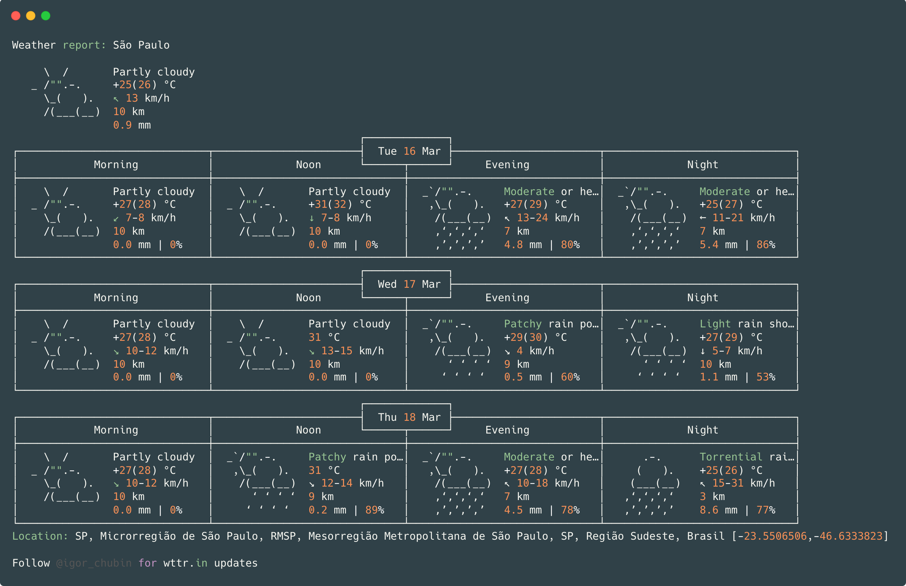
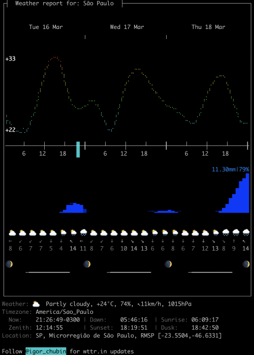

# Tmux Weather

Show detailed weather with a single shortcut using data provided by [wttr.in](https://wttr.in). No modification in the status line.



**Data-rich output format (v2)**



## Installation

### With [Tmux Plugin Manager](https://github.com/tmux-plugins/tpm) (recommended)

Add plugin to the list of TMP plugins in `.tmux.conf`:

```
set -g @plugin 'toruticas/tmux-weather'
```

Press `prefix + I` to fetch the plugin and source it. You should now be able to use the plugin.

### Manual

Clone the repo somewhere. I recommend install in `~/.tmux/plugins/tmux-weather`:

```
$ git clone https://github.com/toruticas/tmux-weather ~/.tmux/plugins/tmux-weather
```

Add `run-shell` in the end of `.tmux.conf`:

```
run-shell ~/.tmux/plugins/tmux-weather/tmux-weather.tmux
```

You should now be able to use the plugin.

## Usage

Press `prefix + y` to display the current weather. Every time you run this plugin, it will generate a cache file for future connection troubles.

## Customization

You can customize this plugin with:

- `set-option -g @tmux-weather-location "São Paulo"` - Set up your location: by default, you will get the weather for your current location based on your IP address.
- `set-option -g @tmux-weather-language "pt-BR"` - Set up your language; by default, you will get the weather info in English.
- `set-option -g @tmux-weather-v2 true` - [Experimental] Set up the data-rich output format with lots of additional weather and astronomical information.

## License

This package was inspired by [xamut/tmux-weather](https://github.com/xamut/tmux-weather). If you are looking to check the weather in the status line, you will love this plugin.

tmux-weather plugin is released under the [MIT License](https://opensource.org/licenses/MIT).
